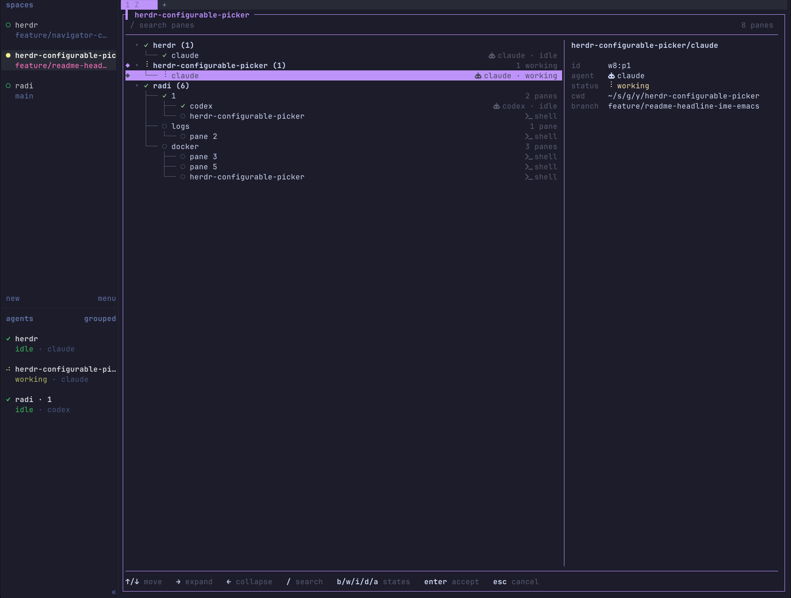

# herdr-configurable-picker

Tree-based goto picker for [herdr](https://herdr.dev) with **Emacs-style movement** and **IME-safe keys** out of the box — and every single binding is yours to change.

## Motivation

The built-in herdr goto (`prefix+g`, `Mode::Navigator` internally) has hard-coded navigation keys, and that bites twice:

- **No Emacs-style movement.** `ctrl+n` / `ctrl+p` only work while the search field is focused; the list itself is `j`/`k`/arrows only, and there is no way to change that.
- **Not IME-safe.** With a Japanese (or any) IME active, bare letter keys get swallowed by the composer before they ever reach the picker.

This plugin binds to a separate key and fixes both by default — `ctrl+n`/`ctrl+p` move anywhere, and every letter action has a `ctrl+` alias that passes through an IME untouched. And since the defaults are just a config file, you can rebind every action — `up`, `down`, `expand`, `collapse`, `accept`, `cancel`, `search`, the state filters, and more — chords like `g g` included.

## Status

**v1.0.0 — stable.** Feature parity with the built-in goto, plus the parts it cannot do (Emacs-style movement everywhere, IME-safe keys, a real tree, direct pane jumps, git branches in the detail panel). See [CHANGELOG.md](./CHANGELOG.md) for history and [SPEC.md](./SPEC.md) for the full design.



## Features

- **Emacs-style movement everywhere**: `ctrl+n`/`ctrl+p` move, `ctrl+v` pages — in the list *and* inside the search prompt, not search-only like the built-in. (`j`/`k` and arrows work too.)
- **IME-safe defaults**: every letter action has an alias that survives an active IME — `ctrl+b`/`ctrl+w`/`ctrl+d`/`ctrl+a` for the state filters, `ctrl+s` for search, `tab` for the idle filter (`ctrl+i` *is* tab to a terminal).
- **All keys user-configurable**: multiple keys per action, chords like `g g`, everything in a plugin-local config file.
- Tree of `workspace → tab → pane` with expand / collapse per branch (`initial_expansion` configurable) and tree-command style guide rails.
- `/` search over labels *and* meta (agent names, states, pane counts) with multi-word AND — `/pick work` intersects; `ctrl+n`/`ctrl+p`/arrows/`enter` keep working inside the prompt.
- State filters (`b`/`w`/`i`/`d`, rebindable): show only blocked / working / idle / done agents; `a` clears.
- Live view: statuses, labels, and panes refresh about once a second while open, with an animated spinner for working agents and per-branch activity summaries (`2 working · 1 blocked`).
- Jumps to any node: workspaces, tabs, and panes — including agentless panes, via the socket-only `pane.focus` (with a `tab.focus` fallback for herdr ≤ 0.7.1).
- A detail panel shows the selected node's id, agent, status (with its colored icon and the working spinner), cwd, and — inside a git repository — the current branch, read straight from `.git/HEAD` (no `git` subprocess; linked worktrees and detached HEADs included). Worktree workspaces also show their repo and branch.
- Status icons in three sets (`nerd` / `ascii` / `emoji`), status colors, `NO_COLOR` support, and `[display]` toggles for icons, pane counts, and cwd.
- Agent icons in the meta column and detail panel (`󰚩 claude · idle`,  for plain shells; 🤖/🐚 with `icon_set = "emoji"`), toggleable via `show_agent_icon`.
- No external runtime dependencies (single Rust binary; TUI via [`ratatui`](https://ratatui.rs/)).
- Talks directly to herdr's API socket — no subprocess per call.

## vs the built-in goto (`prefix+g`)

| | built-in goto | this plugin |
| --- | --- | --- |
| Emacs-style movement | `ctrl+n`/`ctrl+p` while searching only | everywhere, by default |
| IME safety | bare letters only — the IME eats them | `ctrl+` aliases on every action |
| Movement keys | hard-coded | fully rebindable, multiple keys per action, chords |
| Structure | workspace/tab list | workspace → tab → pane tree with expand/collapse |
| Jump to a pane | via its tab | any pane directly (incl. agentless, via socket `pane.focus`) |
| Search keys | fixed | rebindable (`search_start`/`search_clear`/`search_exit`) |
| Rendering | true floating modal | full-canvas pane with a detail panel |
| Ships with herdr | yes | `herdr plugin install yoshiori/herdr-configurable-picker` |

## Install

```bash
herdr plugin install yoshiori/herdr-configurable-picker
```

Then bind a key in your herdr config. The plugin ships an `open` action (herdr keybindings can trigger plugin actions, not panes) that opens the picker overlay:

```toml
[[keys.command]]
key = "prefix+ctrl+g"
type = "plugin_action"
command = "yoshiori.herdr-configurable-picker.open"
description = "configurable goto picker"
```

(`prefix+ctrl+g` mirrors the built-in's `prefix+g` while staying IME-safe; free it from the built-in first if you bound it there, e.g. `goto = ["prefix+g"]`. Any key works.)

## Plugin config

Written to `$HERDR_PLUGIN_CONFIG_DIR/config.toml` on first run. Every key is bindable (multiple keys per action; chords like `"g g"` work):

```toml
[keys]
down      = ["down", "ctrl+n", "j"]
up        = ["up", "ctrl+p", "k"]
page_down = ["pagedown", "ctrl+v"]
page_up   = ["ctrl+u", "pageup"]
top       = ["home"]
bottom    = ["end", "shift+g"]
expand    = ["right", "l"]
collapse  = ["left", "h"]
toggle    = ["space"]
accept    = ["enter"]
cancel    = ["esc", "ctrl+c", "ctrl+g"]

search_start = ["/", "ctrl+s"]
search_clear = ["ctrl+u"]
search_exit  = ["esc"]

filter_blocked = ["b", "ctrl+b"]
filter_working = ["w", "ctrl+w"]
filter_idle    = ["i", "tab"]
filter_done    = ["d", "ctrl+d"]
filter_clear   = ["a", "backspace", "ctrl+a"]
```

The `ctrl+` aliases are for IME users: with a Japanese (etc.) IME active, bare letter keys get swallowed by the composer while `ctrl+letter` passes through. `filter_idle` binds `tab` because `ctrl+i` *is* tab to a terminal (both send `0x09`) — pressing `ctrl+i` works.

Broken or conflicting keys are disabled with a warning (also logged to `$HERDR_PLUGIN_STATE_DIR/picker.log`); the rest keep working. Full config schema in [SPEC.md](./SPEC.md#plugin-config-herdr_plugin_config_dirconfigtoml).

## Development

Requires Rust 1.85+.

```bash
cargo build --release --locked
```

For local iteration on an installed herdr, use `herdr plugin link` on the repo checkout instead of `install`; `link` skips build commands so you control the build cycle.

## License

MIT — see [LICENSE](./LICENSE).
